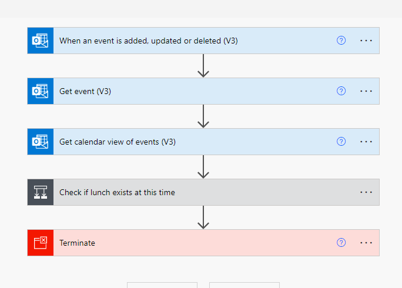
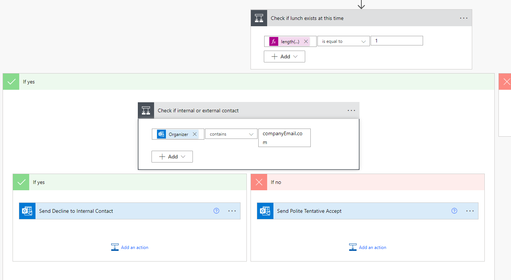
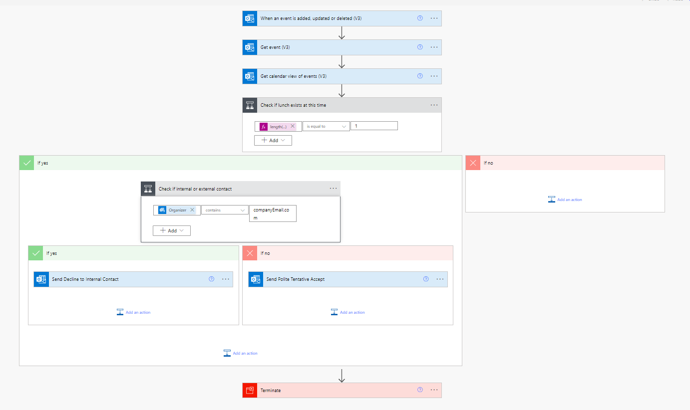

# Outlook - Check if meeting conflicts with lunch

## Summary

This flow checks when new appointments are added to your outlook calendar. If checks to see if an existing appointment titled "Lunch". If the appointment that was sent clashes with the Lunch appointment you have in your Outlook Calendar, it sends a reply to the person. This is configurable to the domain the person sent it from. In this sample, it rejects the appointment if it's sent by someone internally and tentatively accepts if sent externally. Both have configurable messages to each of the replies.





## Applies to


## Compatibility


## Contributiors

 * [Matt Collins-Jones](https://github.com/MattCollins-Jones) 

## Version history

Version|Date|Comments
-------|----|--------
1.0|Feburary 11, 2022|Initial release

## Prerequisites

Dataverse for the solution Import.


## Minimal Path to Awesome

* [Download](./solution/OutlookCheckIfConflictWithLunch.zip) the `.zip` from the `solution` folder
* Within **Power Automate Studio**, import the solution `.zip` file using **Solutions** > **Import Solution** and select the `.zip` file you just packed.
* Open the flow and update the trigger to point to a calendar you want to run this flow from. All subsequent steps will use the triggers calendar.

## Using the Source Code

You can also use the [Power Apps CLI](https://docs.microsoft.com/powerapps/developer/data-platform/powerapps-cli) to pack the source code by following these steps::

* Clone the repository to a local drive
* Pack the source files back into a solution `.zip` file:
  ```bash
  pac solution pack --zipfile pathtodestinationfile --folder pathtosourcefolder
  ```
  Making sure to replace `pathtosourcefolder` to point to the path to this sample's `sourcecode` folder, and `pathtodestinationfile` to point to the path of this solution's `.zip` file (located under the `solution` folder)
* Within **Power Automate Studio**, import the solution `.zip` file using **Solutions** > **Import Solution** and select the `.zip` file you just packed.

## Features

This sample demonstrates:

* Triggering a flow from an Outlook Appointment being receieved
* Filtering an Outlook Calendar to and retrieving entries using the time from the trigger and a keyword "Lunch"
* Replying to the appointment
* Customisable message for people internal or external to the company you work but this can be customised further for specific email domains

## Help
@MattCollins-Jones


We do not support samples, but we this community is always willing to help, and we want to improve these samples. We use GitHub to track issues, which makes it easy for  community members to volunteer their time and help resolve issues.

If you encounter any issues while using this sample, [create a new issue](https://github.com/pnp/powerautomate-samples/issues/new?assignees=&labels=Needs%3A+Triage+%3Amag%3A%2Ctype%3Abug-suspected&template=bug-report.yml&sample=YOURSAMPLENAME&authors=@YOURGITHUBUSERNAME&title=YOURSAMPLENAME%20-%20).

For questions regarding this sample, [create a new question](https://github.com/pnp/powerautomate-samples/issues/new?assignees=&labels=Needs%3A+Triage+%3Amag%3A%2Ctype%3Abug-suspected&template=question.yml&sample=YOURSAMPLENAME&authors=@YOURGITHUBUSERNAME&title=YOURSAMPLENAME%20-%20).

Finally, if you have an idea for improvement, [make a suggestion](https://github.com/pnp/powerautomate-samples/issues/new?assignees=&labels=Needs%3A+Triage+%3Amag%3A%2Ctype%3Abug-suspected&template=suggestion.yml&sample=YOURSAMPLENAME&authors=@YOURGITHUBUSERNAME&title=YOURSAMPLENAME%20-%20).

## Disclaimer

**THIS CODE IS PROVIDED *AS IS* WITHOUT WARRANTY OF ANY KIND, EITHER EXPRESS OR IMPLIED, INCLUDING ANY IMPLIED WARRANTIES OF FITNESS FOR A PARTICULAR PURPOSE, MERCHANTABILITY, OR NON-INFRINGEMENT.**


